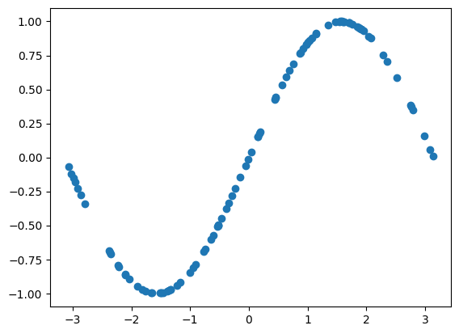
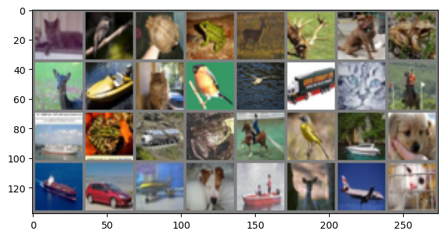
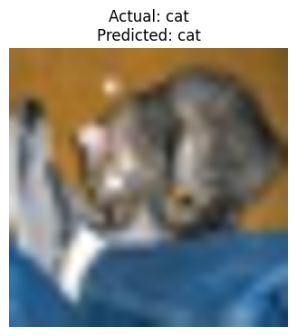

# ML @ Berkeley — Coursework

Notebooks completed for an introductory deep-learning course (Fall 2025), adapted from Stanford's CS231N teaching materials. Each notebook is self-contained and runnable in Colab.

---

## Contents

| Notebook | Topic |
|---|---|
| [`HW_1_INTRO_TO_PYTORCH.ipynb`](HW_1_INTRO_TO_PYTORCH.ipynb) | PyTorch fundamentals: tensors, autograd, datasets, and three ways to build a network |
| [`HW_2A_Resnet.ipynb`](HW_2A_Resnet.ipynb) | CNNs and ResNet: fully-connected → CNN → ResNet18, trained on CIFAR-10 |
| [`HW_4_Vision_Transformers.ipynb`](HW_4_Vision_Transformers.ipynb) | Vision Transformers: multi-head self-attention and a ViT built from scratch |
| [`HW_5_Zero_Shot_CLIP_Classification.ipynb`](HW_5_Zero_Shot_CLIP_Classification.ipynb) | Zero-shot image classification on CIFAR-10 with CLIP |

More assignments will be added here as the course progresses.

---

## HW1 — Introduction to PyTorch

PyTorch behaves like NumPy but adds automatic differentiation, letting you write the forward pass of a network and get gradients for free instead of deriving and coding backprop by hand. The assignment builds up from raw tensors to a trained model in three progressively more abstract ways.

**Covered:**
1. Tensors — NumPy/PyTorch parity (creation, indexing, reshaping, linear algebra)
2. Autograd — automatic differentiation
3. Datasets & `DataLoader` — batching and on-the-fly augmentation
4. Barebones PyTorch — manual forward pass and manual weight updates
5. `nn.Module` — the standard way to define a model
6. `nn.Sequential` — the concise way, for simple architectures

**Dataset pipeline & augmentation**

A `DataLoader` applying a random-rotation transform on every read, so the same source image comes out differently each epoch:


**Fitting a nonlinear function**

An early barebones-PyTorch exercise: fit a small network to a noisy `sin(x)` dataset using nothing but tensors and manual gradient updates.



---

## HW2A — ResNet

Builds up to the residual network (ResNet) architecture in stages, on CIFAR-10, to see directly what each architectural change buys in accuracy.

**Covered:**
1. Loading CIFAR-10 via `torchvision`
2. A fully-connected baseline
3. A basic CNN — better accuracy with 80% fewer parameters than the fully-connected version
4. ResNet18 — implementing a residual block (the skip-connection trick that fixes vanishing gradients in deep networks) and chaining it into a full model
5. Hyperparameter tuning and data augmentation, targeting 85%+ validation accuracy

**CIFAR-10 samples**



---

## HW4 — Vision Transformers

Implements a Vision Transformer (ViT) from scratch, following ["An Image is Worth 16x16 Words"](https://arxiv.org/abs/2010.11929): multi-head self-attention written with batched matrix operations (no `for` loops), then patch embeddings + positional embeddings feeding into the transformer.

---

## HW5 — Zero-Shot CLIP Classification

Uses OpenAI's CLIP model for zero-shot classification on CIFAR-10 — classifying images into categories the model was never explicitly trained on, by matching image embeddings against text-template embeddings of the class names, then evaluating top-k accuracy.



---

## Setup

```bash
pip install torch torchvision numpy matplotlib
```

Open any notebook in Jupyter or Colab (badges are included at the top of each notebook) and run top to bottom.
